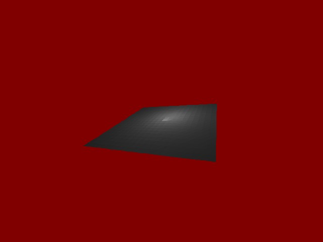



## SpotLight3D pure VB

### Description

Light a 3d scene with a spot light filter.
 
### More Info
 
Numpads 0,1,2

Look the screen !

             |
---                |---
**Submitted On**   |2005-03-09 16:51:26
**By**             |[KACI  Lounes](https://github.com/Planet-Source-Code/PSCIndex/blob/master/ByAuthor/kaci-lounes.md)
**Level**          |Intermediate
**User Rating**    |4.8 (19 globes from 4 users)
**Compatibility**  |VB 4\.0 \(32\-bit\), VB 5\.0, VB 6\.0
**Category**       |[Graphics](https://github.com/Planet-Source-Code/PSCIndex/blob/master/ByCategory/graphics__1-46.md)
**World**          |[Visual Basic](https://github.com/Planet-Source-Code/PSCIndex/blob/master/ByWorld/visual-basic.md)
**Archive File**   |[SpotLight31863223102005\.zip](https://github.com/Planet-Source-Code/kaci-lounes-spotlight3d-pure-vb__1-59408/archive/master.zip)

### API Declarations

No APIs

